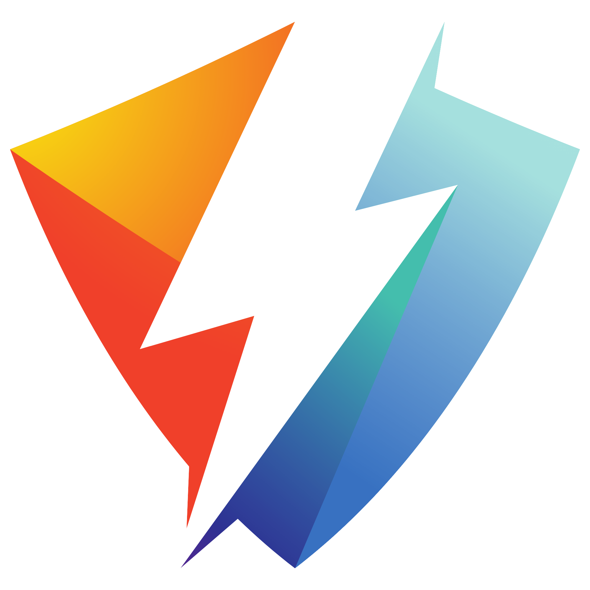

#  StrikeMSG

  

**Hyper-chat app that works for you.** Licences page:

---

### Software: Visual Studio Code
Coding platform

### Software: Gemini 3.1 Pro
Artifical Intelligence Agent

### Coding tools: HTML5, CSS3, Node.js
Coding tools used in the assistance of building the project

### Publishing tools: github.oi and git.
Publishing tools used in assistance of making the project public. Github and Github Pages were used to publish the website and frontend tools. Git was used for src version control.